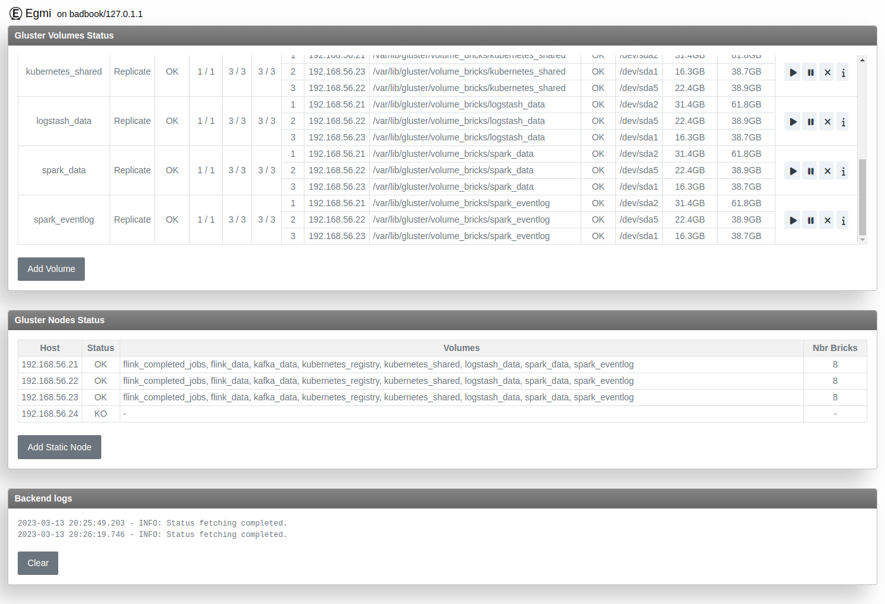

////
This file is part of the eskimo project referenced at www.eskimo.sh. The licensing information below apply just as
well to this individual file than to the Eskimo Project as a whole.

Copyright 2019 www.eskimo.sh - All rights reserved.
Author : http://www.eskimo.sh

Eskimo is available under a dual licensing model : commercial and GNU AGPL.
If you did not acquire a commercial licence for Eskimo, you can still use it and consider it free software under the
terms of the GNU Affero Public License. You can redistribute it and/or modify it under the terms of the GNU Affero
Public License  as published by the Free Software Foundation, either version 3 of the License, or (at your option)
any later version.
Compliance to each and every aspect of the GNU Affero Public License is mandatory for users who did no acquire a
commercial license.

Eskimo is distributed as a free software under GNU AGPL in the hope that it will be useful, but WITHOUT ANY
WARRANTY; without even the implied warranty of MERCHANTABILITY or FITNESS FOR A PARTICULAR PURPOSE. See the GNU
Affero Public License for more details.

You should have received a copy of the GNU Affero Public License along with Eskimo. If not,
see <https://www.gnu.org/licenses/> or write to the Free Software Foundation, Inc., 51 Franklin Street, Fifth Floor,
Boston, MA, 02110-1301 USA.

You can be released from the requirements of the license by purchasing a commercial license. Buying such a
commercial license is mandatory as soon as :
- you develop activities involving Eskimo without disclosing the source code of your own product, software,
  platform, use cases or scripts.
- you deploy eskimo as part of a commercial product, platform or software.
For more information, please contact eskimo.sh at https://www.eskimo.sh

The above copyright notice and this licensing notice shall be included in all copies or substantial portions of the
Software.
////

:sectnums:
:authors: www.eskimo.sh / 2019
:copyright: www.eskimo.sh / 2019

== EGMI - Eskimo Gluster Management Interface

=== Introduction

EGMI stands for *Eskimo Gluster Management Interface*. EGMI is a daemon running on machines or containers along
https://www.gluster.org/[Gluster FS] and taking care of managing gluster volumes and peers automatically (for most
common operations).

The fundamental idea behind EGMI is that operators should not have to do so much manual operations to build and maintain
a gluster cluster. +
EGMI inspires from the way most widely used Big Data / NoSQL backends manage their shards and replicas transparently,
balancing new replicas to new nodes automatically whenever a node goes down, etc. +
EGMI aims at bringing the same level of automatic operation and reliability on top of Gluster FS and well at
simplifying all aspects of gluster volumes management and repairing.

EGMI also included a web interface for monitoring and to help administrators perform some simple manual operations and
configuration.

=== EGMI Project Development  Status

*GitHub Action CI Integration Build Status* +
image:https://github.com/eskimo-sh/egmi/actions/workflows/maven.yml/badge.svg["Build Status", link="https://github.com/eskimo-sh/egmi/actions/"]

// *SonarCloud Quality Checks Status* +
// image:https://sonarcloud.io/api/project_badges/measure?project=eskimo-sh_egmio&metric=alert_status["Sonarcloud Status", link="https://sonarcloud.io/dashboard?id=eskimo-sh_egmi"]

=== Principles

*Automatic nodes and volumes management*

With EGMI, the administrators needs to define in egmi's configuration file:

* Either a *Zookeeper URL* when using Zookeeper for master election and node discovery.
** In this case, the managed nodes are discovered automatically through zookeeper
** Also, one of the EGMI instance registering to zookeeper is elected master and takes care of global cluster management.
* Or, in case zookeeper is not used (or used only for master election), a list of *Managed nodes*:  the set of nodes
where gluster is expected to be running. Additional nodes discovered in gluster peers are considered as well.
* *The Managed Volumes*: the set of gluster volumes to be created and managed. Additional volumes discovered in gluster
peers are considered as well.
* *The target number of replicas*: Either as a fixed number or a strategy to compute the number, EGMI will manage and
extend volumes as required to respect this number whenever possible.
* *The target number of shards*: Either as a fixed number or a strategy to compute the number, EGMI will attempt to
create as many bricks as required to reach this number of shards (distribution) times the number of replicas if possible.

*EGMI is deployed on every node running gluster*

EGMI is designed to be deployed along Gluster FS on every node or container from the gluster cluster. This is a strict
requirement since every EGMI instance will administer the co-located Gluster FS instance. +
At every moment in time, only one of these EGMI process is considered master and is taking decisions for the whole
cluster.

*Using Zookeeper for master election and Node discovery*

EGMI uses Zookeeper for master election. Zookeeper is used solely to elect the master taking decisions for the whole
cluster and not for state storage. +
EGMI can also run on a single node deployment without Zookeeper. If no Zookeeper URL is configured, an EGMI instance
assumes it is the master.

Also, by default, zookeeper is also used to discover EGMI nodes in the cluster. This can be disabled and the list of
nodes can be configured in EGMI's configuration file.

*Stateless*

EGMI itself is stateless. EGMI uses Gluster FS to store state and always returns to querying Gluster instances to
recover the Gluster cluster state.
Optionally, when zookeper is used, cluster state (such as data nodes and master) are managed through zookeeper.

*UI Redirection to master node*

Every EGMI instance running on evefy cluster nodes as a Web UI - Graphical User Interface - up, running and available
on the configured port. However, onl the master node UI is answering. Slave nodes UI on slave nodes redirect the user
to master node UI.

== Building EGMI

=== Prerequisites

EGMI needs following software available in order to be built:

* Open JDK 11 (or compatible) with `java` in `PATH`.
* Apache Maven 3.x (or compatible) with `mvn` in `PATH`

All the rest is expressed as maven dependencies and fetched from maven repositories as part of the maven build proces.

=== Building

Simply type on the command line at the root of the project:

`mvn clean install`

== EGMI Deployment

Again, EGMI has to be installed on every machine or container running _Gluster FS_.
EGMI is started using the startup script `egmi.sh` or the provided SystemD unit file and setup script.

=== Installation

Just extract the EGMI archive to the root folder where you want to install EGMI.

=== Configuration

EGMI is configured in `egmi.properties` configuration file located under `conf` under the root EGMI installation folder.

The most essential configuration properties to be adapted *whenever egmi is to be used outside of eskimo* are as
follows.

==== Cluster and Server configuration

* `zookeeper.urls` : the URL(s) (coma-separated list of IP:PORT where zookeeper is expected.) at which zookeeper
server(s) is(are) expected. Whenever this is configured, EGMI will
use zookeeper for master election. Leave it blank to force either master or slave on one EGMI instance without using
zookeeper.
* `hostname` : the hostname this instance of EGMI is identified by on the gluster cluster (most of the time the IP
address of the node)
* `server.port`: the port EGMI listens to (both EGMI UI and EGMI command server)
* `remote.egmi.port` : the port where the remote EGMI command server listens to. *This should in principe be the same
port as above*. But in case the EGMI master orchestrates remote slaves running on different port, this can be usefull.
* `target.ip-addresses` : coma-separated hostnames or IP addresses of the gluster cluster. EGMI will connect all these
nodes together (add peers in pool) if some nodes are disconnected from the gluster. +
This should be left blank to rely on zookeeper for data node discovery.
zookeeper for data node discovery but can be configured here when not using zookeeper.
* `master` : set to true or false for force master or slave on one EGMI instance regardless of zookeeper election
process.

==== EGMI backend configuration

* `data` : set to true to have the node registerd as a data node (managed gluster node) within zookeeper.
* `target.volumes`: coma-separated list of volumes to be managed. This has to be given and needs to be consistent
across EGMI instances.
* `config-storage-path`: where the EGMI runtime configuration (meta-data) has to be stored. EGMI is more or less
stateless but some of the discovered nodes or volumes are tracked in a meta-data file stored there. (If this file is
deleted, it doesn't impact EGMI significantly)
* `zookeeper.sessionTimeout` : the zookeeper session timeout (used to trigger a new master election)
* `master.redirect.URLPattern` : the URL pattern used to redirect users reaching an EGMI slave to the master.

==== Gluster Management configuration

* `target.numberOfBricks` : the number of bricks to create and manage for volumes (either a fixed number or "ALL_NODES"
to have every volume having a brick on every node or "LOG_DISPATCH" to have shared and replicas distributed on log(n)
nodes)
* `target.defaultNumberReplica` : the target number of replicas to try to respect for every node.

*Important note*
This configuration needs to be aligned on every node. It is not a strict requirement and a configuration discrepency
between nodes may be somewhat tolerated by EGMI. +
However, it can lead to unexpected results and every node in the gluster cluster should have same EGMI configuration

[appendix]
== Copyright and License

EGMI is part of the Eskimo software platform.

Eskimo is Copyright 2019 - 2021 eskimo.sh - All rights reserved. +
Author : http://www.eskimo.sh

Eskimo is available under a dual licensing model : commercial and GNU AGPL. +
If you did not acquire a commercial licence for Eskimo, you can still use it and consider it free software under the
terms of the GNU Affero Public License. You can redistribute it and/or modify it under the terms of the GNU Affero
Public License  as published by the Free Software Foundation, either version 3 of the License, or (at your option)
any later version. +
Compliance to each and every aspect of the GNU Affero Public License is mandatory for users who did no acquire a
commercial license.

Eskimo is distributed as a free software under GNU AGPL in the hope that it will be useful, but WITHOUT ANY
WARRANTY; without even the implied warranty of MERCHANTABILITY or FITNESS FOR A PARTICULAR PURPOSE. See the GNU
Affero Public License for more details.

You should have received a copy of the GNU Affero Public License along with Eskimo. If not,
see <https://www.gnu.org/licenses/> or write to the Free Software Foundation, Inc., 51 Franklin Street, Fifth Floor,
Boston, MA, 02110-1301 USA.

You can be released from the requirements of the license by purchasing a commercial license. Buying such a
commercial license is mandatory as soon as :

* you develop activities involving Eskimo without disclosing the source code of your own product, software, platform,
use cases or scripts.
* you deploy eskimo as part of a commercial product, platform or software.

For more information, please contact eskimo.sh at https://www.eskimo.sh

The above copyright notice and this licensing notice shall be included in all copies or substantial portions of the
Software.
